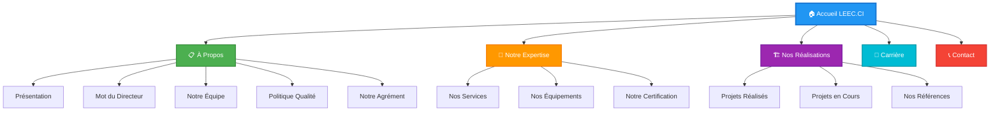
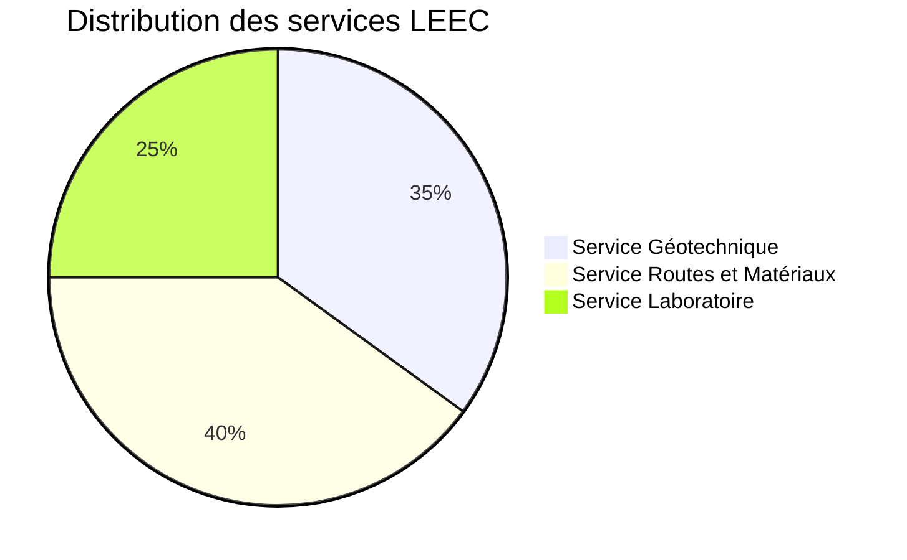
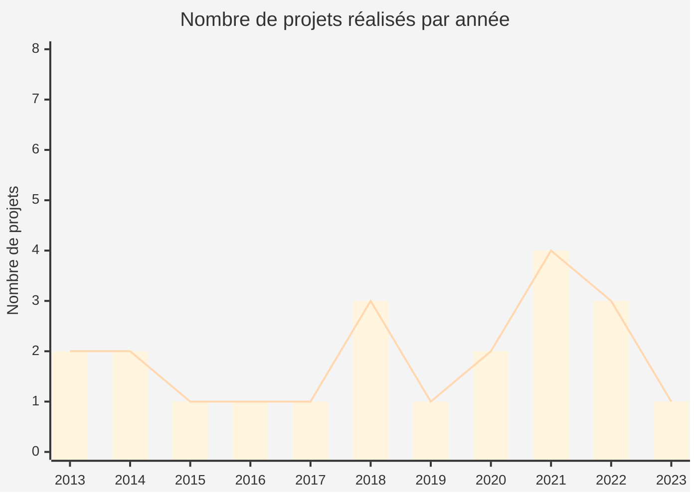
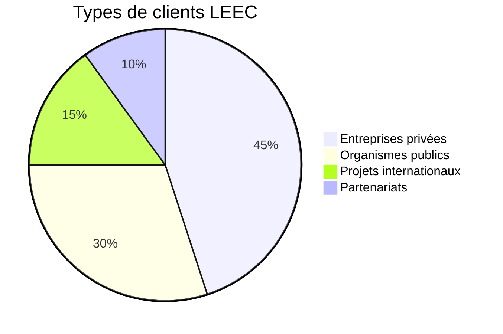
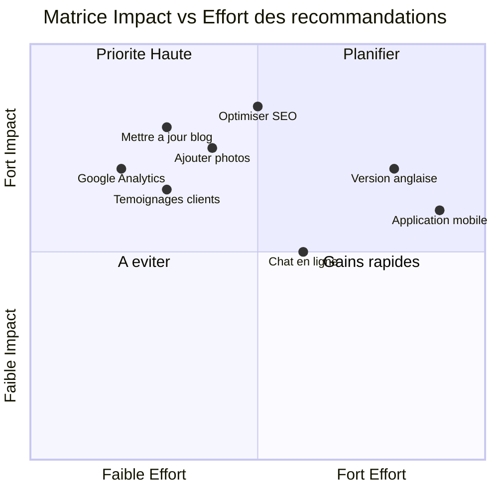
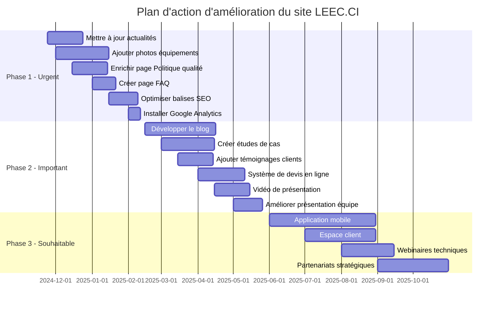
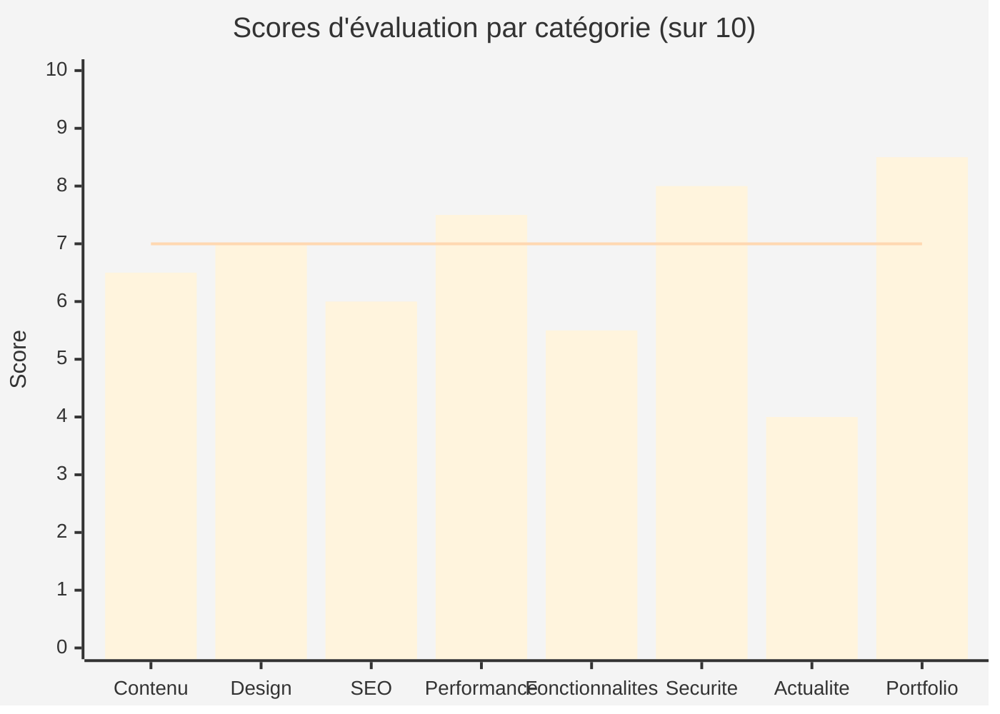
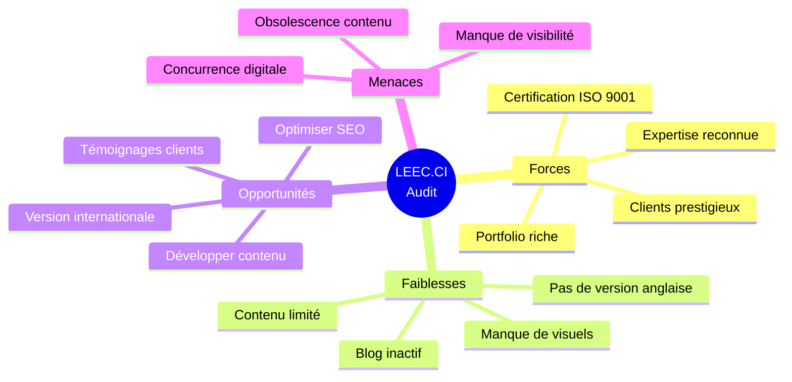

# AUDIT COMPLET DU SITE WEB LEEC.CI

**Date de l'audit :** 24 novembre 2024  
**URL du site :** https://leec.ci/  
**Type d'entreprise :** Laboratoire d'Études, d'Expertises et de Contrôle (BTP et Génie Civil)

---

## RÉSUMÉ EXÉCUTIF

LEEC (Laboratoire d'Études, d'Expertises et de Contrôle) est un laboratoire BTP créé en 2012, certifié ISO 9001 V2015, spécialisé dans les études géotechniques, les essais en laboratoire et le contrôle qualité des travaux. Le site web présente l'entreprise, ses services, son équipe et ses réalisations.

### Points forts

-  ✅ Certification ISO 9001 V2015 mise en avant
-  ✅ Agrément officiel de l'État de Côte d'Ivoire
-  ✅ Portfolio de projets conséquent
-  ✅ Informations de contact complètes
-  ✅ Présence sur les réseaux sociaux

### Points à améliorer

-  ⚠️ Contenu limité sur certaines pages
-  ⚠️ Absence de blog actif (dernière actualité en 2022)
-  ⚠️ Manque d'optimisation SEO sur certaines pages
-  ⚠️ Absence de version multilingue (anglais)

### Évaluation globale du site

## 1. PAGE D'ACCUEIL (https://leec.ci/)

### 1.1 Contenu et Structure

**Éléments présents :**

-  Hero section avec appel à l'action "NOUS DÉCOUVRIR"
-  Bouton "Obtenir un devis gratuitement" bien visible
-  Mission, Vision et Valeurs clairement affichées
-  Mot du Directeur Général (SIHOULI Konan Vivien)
-  Présentation des 3 services principaux
-  Section actualités (dernière mise à jour : 2022)
-  Footer complet avec liens utiles et coordonnées

**Mission :**

> "Assurer la réussite de vos projets de construction grâce à une expertise technique et un accompagnement personnalisé"

**Vision :**

> "Contribuer à la pérennisation de nos infrastructures économiques et de nos biens immobiliers par la solidité des fondations et la qualité des matériaux utilisés et une approche durable et responsable."

**Valeurs :**

> Intégrité, Responsabilité, Innovation, Passion, Respect des engagements

### 1.2 Navigation

**Menu principal structuré en 5 sections :**

1. **A propos** (5 sous-pages)

   -  Présentation de LEEC
   -  Le mot du directeur
   -  Notre équipe
   -  Politique qualité
   -  Notre agrément

2. **Notre expertise** (3 sous-pages)

   -  Nos services
   -  Nos équipements
   -  Notre certification

3. **Nos réalisations** (3 sous-pages)

   -  Nos projets réalisés
   -  Projets en cours
   -  Nos références

4. **Carrière**

5. **Nous contacter**

#### Structure du site - Arborescence

### 1.3 Points forts

-  ✅ Structure claire et professionnelle
-  ✅ Message du directeur personnalise le contact
-  ✅ Mise en avant de la certification ISO 9001 V2015
-  ✅ Call-to-action pour obtenir un devis
-  ✅ Coordonnées complètes (téléphone, email, adresse, horaires)
-  ✅ Intégration des réseaux sociaux (Facebook, WhatsApp, Twitter)

### 1.4 Points à améliorer

-  ⚠️ Section actualités non mise à jour (dernière publication : 2022)
-  ⚠️ Absence d'images illustratives des projets sur la page d'accueil
-  ⚠️ Pas de témoignages clients
-  ⚠️ Absence de statistiques clés (nombre de projets, années d'expérience, etc.)

### 1.5 SEO et Métadonnées

-  **Title :** "Études de sols et géotechniques, LEEC, votre partenaire technique"
-  **Meta Description :** "Laboratoire d'études géotechniques des sols. Laboratoire d'essai BTP, réalisant des contrôles qualités précis pour vos projets de constructions et infrastructures en CI."
-  ✅ Bonne optimisation des balises meta
-  ✅ Description claire et pertinente

---

## 2. SECTION "À PROPOS"

### 2.1 Présentation de LEEC (https://leec.ci/presentation-de-leec/)

**Contenu :**

-  Année de création : 2012
-  Statut : Laboratoire BTP et génie civil
-  Certification : ISO 9001 V2015
-  Agrément : N°00000019/MCU/CAB du 07/07/2016
-  Spécialités : études de sols, études géotechniques, essais en laboratoire, contrôle qualité

**Points forts :**

-  ✅ Informations essentielles présentes
-  ✅ Mise en avant de la certification et de l'agrément
-  ✅ Mention du matériel performant et du personnel qualifié

**Points à améliorer :**

-  ⚠️ Contenu très court
-  ⚠️ Absence d'historique détaillé de l'entreprise
-  ⚠️ Pas de chiffres clés (nombre d'employés, projets réalisés, etc.)
-  ⚠️ Manque de photos de l'entreprise ou des installations

**SEO :**

-  **Meta Description :** Correcte mais pourrait être plus détaillée

### 2.2 Le mot du directeur (https://leec.ci/mots-du-dg/)

**Contenu :**

-  Message personnalisé du Directeur Général
-  Présentation de SIHOULI Konan Vivien
-  Diplôme : Ingénieur des travaux publics (INP-HB Yamoussoukro, promotion 2001)
-  Spécialisation : géotechnique et matériaux de construction

**Points forts :**

-  ✅ Message chaleureux et professionnel
-  ✅ Présentation des qualifications du directeur
-  ✅ Mise en avant des valeurs de l'entreprise
-  ✅ Engagement envers la satisfaction client

**Points à améliorer :**

-  ⚠️ Pas de lien vers LinkedIn ou profil professionnel

### 2.3 Notre équipe (https://leec.ci/lequipe/)

**Analyse :**

-  Mention de l'importance du capital humain
-  Référence à un personnel d'encadrement qualifié

**Points à améliorer :**

-  ⚠️ Absence de présentation détaillée des membres de l'équipe
-  ⚠️ Pas de photos du personnel de façon individuel
-  ⚠️ Manque d'informations sur les qualifications et expériences

### 2.4 Politique qualité (https://leec.ci/politique-qualite/)

**Analyse :**

-  Seule mention : "LABORATOIRE CERTIFIÉ ISO 9001 V2015" dans les métadonnées

**Points à améliorer :**

-  ⚠️ Pas d'explication des processus qualité
-  ⚠️ le document présenté n'est pas téléchargeable

## 3. SECTION "NOTRE EXPERTISE"

### 3.1 Nos services (https://leec.ci/nos-services/)

**Structure :** 3 services principaux bien définis

#### Répartition des services LEEC

#### 3.1.1 Service Géotechnique

**Prestations :**

-  Reconnaissance des sols et études de fondations
-  Essai au pénétromètre dynamique lourd
-  Sondage à la tarière manuelle
-  Essai Pressiométrique Ménard
-  Essai SPT (Standard Penetration Test)
-  Essai CPTu (Cone Penetration Test)
-  Sondage carotté
-  Essai au pénétromètre dynamique léger
-  Essai au pénétromètre dynamique DCP
-  Pose et relevé piézométrique
-  Essai de perméabilité de type Lefranc
-  Essai de résistivité

#### 3.1.2 Service Routes et Matériaux

**Prestations :**

-  Contrôle du compactage (essai à la plaque, densité in-situ)
-  Contrôle qualité des matériaux (sable, granulats, bétons, agglomérés, briques, hourdis, pavés, fers à béton, enrobés bitumineux)
-  Auscultation des couches de chaussées (mesures de déflexion, sondages sous chaussées, relevés de dégradations, mesures d'unis, comptage et pesées d'essieux)
-  Expertise des bâtiments et ouvrages de génie civil (inspection, tests au scléromètre, détection des armatures, auscultation sonique, carottage, inspection géotechnique des fondations)

#### 3.1.3 Service Laboratoire

**Essais réalisés :**

-  Étude de formulation de béton et enrobés bitumineux
-  Analyse granulométrique (classique et par sédimentométrie)
-  Limites d'Atterberg
-  Essai au bleu de Méthylène
-  Teneur en eau naturelle
-  Essai Proctor modifié
-  Essai CBR
-  Poids spécifique et apparent
-  Compression sur béton et agglos
-  Traction sur acier
-  Propreté de sable
-  Fragmentation Los Angeles
-  Analyse chimique sur sol
-  Essai Marshall
-  Extraction de bitume
-  Densité par pesée hydrostatique
-  Perméabilité
-  Compressibilité à l'œdomètre
-  Cisaillement direct

**Points forts :**

-  ✅ Liste exhaustive et détaillée des services
-  ✅ Terminologie technique professionnelle
-  ✅ Couverture complète des besoins en géotechnique et BTP

**Points à améliorer :**

-  ⚠️ Pas de fiches techniques téléchargeables
-  ⚠️ Manque d'explications vulgarisées pour les non-spécialistes
-  ⚠️ Absence de tarifs indicatifs ou de processus de devis

**SEO :**

-  **Title :** "Expertises techniques: études géotechnique et contrôle qualité"
-  **Meta Description :** "Laboratoire BTP spécialisé en études de sol et essais techniques. Expertise géotechnique de précision, contrôles qualité rigoureux pour garantir la performance de vos projets de construction."
-  ✅ Bonne optimisation

### 3.2 Nos équipements (https://leec.ci/nos-equipements/)

**Contenu :**

-  Matériel provenant de fabricants étrangers
-  Équipements neufs conformes aux normes
-  Normes : Françaises, Européennes et Internationales
-  Matériel certifié par le constructeur
-  Étalonnage périodique par société de métrologie

**Points forts :**

-  ✅ Mention de la conformité aux normes internationales
-  ✅ Référence à l'étalonnage périodique

**Points à améliorer :**

-  ⚠️ Absence de liste détaillée des équipements
-  ⚠️ Manque de spécifications techniques
-  ⚠️ Absence de marques/modèles des équipements

**SEO :**

-  **Title :** "Laboratoire BTP, équipements techniques, innovations"
-  ✅ Titre optimisé

### 3.3 Notre certification (https://leec.ci/notre-certification/)

**Contenu :**

-  Certification ISO 9001 V2015

**Points à améliorer :**

-  ⚠️ Contenu extrêmement limité
-  ⚠️ Absence de certificat téléchargeable
-  ⚠️ Absence d'explication de ce que signifie ISO 9001 V2015

## 4. SECTION "NOS RÉALISATIONS"

### 4.1 Nos projets réalisés (https://leec.ci/nos-projets/)

**Portfolio impressionnant de projets :**

#### Évolution des projets par année

#### Répartition des projets par type de client

#### Projets 2023

-  **PETRO IVOIRE** : Étude géotechnique pour construction station-service à Abidjan Cocody Djorobité

#### Projets 2022

-  **EDE** : Études géotechniques pour gestion des déchets solides à Bouaké (15 hectares)
-  **BERGEC** : Laboratoire de chantier pour programme immobilier 12 hectares à Bingerville (ARTCI)
-  **ACTIVA** : (Détails non précisés)

#### Projets 2021

-  **OIM** : (Détails non précisés)
-  **SNEDAI (OMNI TRAVAUX)** : (2 projets)
-  **LIGHT GROUP** : Étude géotechnique pour usine à Yamoussoukro (4 hectares)
-  **AEC** : Étude géotechnique pour construction seuil sur fleuve Comoé à M'Basso

#### Projets 2020-2021

-  **TOTAL CI** : Études géotechniques pour stations-services dans plusieurs villes de Côte d'Ivoire

#### Projets 2020

-  **CTA/FOXTROT** : Étude géotechnique pour centrale à gaz à Jacqueville, Taboth (Cipre V)

#### Projets 2019

-  **SICMA** : Étude géotechnique pour ligne 1 du métro d'Abidjan

#### Projets 2018

-  **MATTA Côte d'Ivoire** : Laboratoire de chantier pour liaison Ananeraie-Niangon (2km)
-  **ACE Ingénieur Conseil** : Laboratoire de chantier pour aire de station Noé et Aboisso
-  **SUPERMARITIME** : Étude géotechnique pour hangar métallique au Port d'Abidjan

#### Projets 2017

-  **VITIB/GENIBAT** : Étude géotechnique pour pont piéton sur autoroute Abidjan-Grand Bassam

#### Projets 2016

-  **BETA ENTREPRISE** : Étude géotechnique pour bâtiment R+10 (CACOMIAF) à Treichville

#### Projets 2014-2015

-  **ACE Ingénieur Conseil** : Laboratoire de chantier pour pont (4 x 15,8 m) Grebouo 2 – Dobré (Projet PRICI-Banque Mondiale)
-  **OMNI TRAVAUX** : Contrôle qualité bitumage 5 Km à Abengourou (Projet PRICI-Banque Mondiale)

#### Projets 2014

-  **EQUINOX PLANET** : Étude géotechnique programme immobilier 20 hectares à Cocody Djorogobité

#### Projets 2013

-  **GAUFF INGENIEURE** : Études géotechniques et recherches de matériaux pour bitumage voiries (Abengourou, Soubré, San Pedro)
-  **APAV-CI** : Laboratoire de chantier pour station de pesage d'Allokoi

**Autres réalisations mentionnées :**

-  Études géotechniques CAFOP de Bondoukou et San Pedro
-  Études géotechniques et contrôle qualité 10 stations TOTAL à Abidjan
-  Études pour implantation de pylônes à Abidjan et intérieur du pays
-  Laboratoire de chantier bitumage voiries Yopougon Andokoi et Banco
-  Mission de reprofilage lourd et traitement points critiques (1000 Km) dans régions Nawa, Gbèkè, Hambol, Sud-Comoé

**Points forts :**

-  ✅ Portfolio très riche (plus de 30 projets documentés)
-  ✅ Clients prestigieux (TOTAL, OIM, Banque Mondiale, etc.)
-  ✅ Diversité des projets (métro, stations-service, immobilier, infrastructures)
-  ✅ Présence sur projets d'envergure nationale

**Points à améliorer :**

-  ⚠️ Absence de photos des projets
-  ⚠️ Certains projets sans détails (ACTIVA, OIM)
-  ⚠️ Manque de cas d'études détaillés
-  ⚠️ Absence de résultats chiffrés

**SEO :**

-  **Title :** "Réalisations et références en génie civil"
-  ✅ Bon titre SEO

### 4.2 Projets en cours (https://leec.ci/projets-en-cours/)

**Analyse :** Aucun projet listé

**Recommandation :** Vérifier l'existence et le contenu de cette page

### 4.3 Nos références (https://leec.ci/nos-references/)

**Analyse :** Page identifiée mais contenu non accessible dans l'audit

**Recommandation :** Vérifier l'existence et le contenu de cette page

---

## 5. PAGE CARRIÈRE (https://leec.ci/carriere/)

**Contenu :**

-  Formulaire de dépôt de CV
-  Possibilité d'envoi par email : leec.infos@gmail.com
-  Téléchargement de CV en ligne

**Points forts :**

-  ✅ Page dédiée au recrutement
-  ✅ Formulaire de candidature
-  ✅ Contact direct fourni

**Points à améliorer :**

-  ⚠️ Absence d'offres d'emploi spécifiques
-  ⚠️ Pas de description des profils recherchés
-  ⚠️ Manque d'informations sur la culture d'entreprise
-  ⚠️ Absence d'avantages/bénéfices employés
-  ⚠️ Pas de processus de recrutement décrit

---

## 6. PAGE CONTACT (https://leec.ci/nos-contacts/)

**Informations complètes :**

**Adresse :**

-  En face de l'Église Réveil Riviera Bonoumin
-  Cocody Abidjan - Côte d'Ivoire

**Téléphones :**

-  (+225) 27 22 52 05 92
-  (+225) 07 87 20 64 11

**Email :**

-  leec.infos@gmail.com

**Horaires :**

-  Lundi au Vendredi : 08h00 à 17h00
-  Samedi – Dimanche : Fermé

**Réseaux sociaux :**

-  Facebook : https://www.facebook.com/LEECentreprise
-  WhatsApp : Lien direct
-  Twitter : https://twitter.com/LeecInfos

**Fonctionnalités :**

-  Formulaire de contact "ENVOYER MESSAGE"
-  Lien vers itinéraire Google Maps

**Points forts :**

-  ✅ Informations complètes et claires
-  ✅ Plusieurs moyens de contact
-  ✅ Intégration Google Maps
-  ✅ Formulaire de contact
-  ✅ Présence sur réseaux sociaux

**Points à améliorer :**

-  ⚠️ Utilisation d'une adresse Gmail (pas d'email professionnel @leec.ci)
-  ⚠️ Absence de chat en ligne
-  ⚠️ Pas de FAQ

**SEO :**

-  **Title :** "Contactez LEEC – Expert en étude géotechnique et contrôle qualité"
-  ✅ Excellent titre SEO

---

## 7. SECTION ACTUALITÉS

**Dernière publication :** REVUE DE DIRECTION 2022

**Points à améliorer :**

-  ⚠️ Blog non mis à jour depuis 2022
-  ⚠️ Absence d'articles récents
-  ⚠️ Manque de contenu éditorial
-  ⚠️ Pas de newsletter

**Recommandations :**

-  Publier régulièrement des actualités de l'entreprise
-  Partager des études de cas
-  Publier des articles techniques
-  Annoncer les nouveaux projets
-  Partager les certifications et récompenses

---

## 8. ANALYSE TECHNIQUE

### 8.1 Design et UX

**Points forts :**

-  ✅ Design professionnel et épuré
-  ✅ Navigation claire et intuitive
-  ✅ Structure logique de l'information
-  ✅ Footer informatif sur toutes les pages

**Points à améliorer :**

-  ⚠️ Manque d'éléments visuels (photos, vidéos)
-  ⚠️ Absence d'animations ou d'interactivité
-  ⚠️ Design pourrait être plus moderne

### 8.2 Responsive Design

**Recommandation :** Site responsive

### 8.3 SEO

**Points forts :**

-  ✅ Balises title optimisées
-  ✅ Meta descriptions présentes
-  ✅ Structure de contenu claire
-  ✅ URLs propres et descriptives

**Points à améliorer :**

-  ⚠️ Absence de balises H1 sur certaines pages
-  ⚠️ Manque de contenu textuel sur certaines pages
-  ⚠️ Absence de sitemap XML visible
-  ⚠️ Pas de blog actif (important pour le SEO)

### 8.4 Sécurité

**Points forts :**

-  ✅ Site en HTTPS

**À vérifier :**

-  Certificat SSL valide
-  Sécurité des formulaires
-  Protection contre les spams

---

## 9. ANALYSE CONCURRENTIELLE

### 9.1 Positionnement

**Forces :**

-  Certification ISO 9001 V2015
-  Agrément officiel de l'État
-  Portfolio de clients prestigieux
-  Expérience depuis 2012

**Opportunités :**

-  Développer le contenu éditorial
-  Améliorer la présence en ligne
-  Créer des ressources téléchargeables

### 9.2 Différenciation

**Éléments différenciants à mettre en avant :**

-  Certification ISO 9001 V2015
-  Équipements certifiés et étalonnés
-  Personnel qualifié
-  Expérience sur projets d'envergure nationale

---

## 10. RECOMMANDATIONS PRIORITAIRES

### Matrice de priorisation des recommandations

### 10.1 Contenu (Priorité HAUTE)

1. **Enrichir les pages existantes**

   -  Ajouter du contenu sur la page "Politique qualité"
   -  Développer la présentation de l'équipe avec photos et CV
   -  Créer des fiches techniques détaillées des services
   -  Ajouter des études de cas détaillées

2. **Créer du contenu visuel**

   -  Photos des équipements
   -  Photos des projets réalisés
   -  Vidéo de présentation de l'entreprise
   -  Visite virtuelle du laboratoire

3. **Développer le blog**
   -  Publier au moins 2 articles par mois
   -  Partager des actualités de l'entreprise
   -  Créer des guides techniques
   -  Publier des études de cas

### 10.2 Fonctionnalités (Priorité MOYENNE)

1. **Améliorer l'interaction**

   -  Ajouter un chat en ligne
   -  Créer une FAQ
   -  Développer un système de devis en ligne
   -  Ajouter des témoignages clients

2. **Optimiser le référencement**

   -  Créer un sitemap XML
   -  Optimiser les balises H1-H6
   -  Améliorer le maillage interne
   -  Créer des backlinks de qualité

3. **Développer l'international**
   -  Créer une version anglaise du site
   -  Adapter le contenu pour les marchés internationaux

### 10.3 Technique (Priorité MOYENNE)

1. **Performance**

   -  Optimiser la vitesse de chargement
   -  Compresser les images
   -  Mettre en place un CDN
   -  Activer la mise en cache

2. **Sécurité**

   -  Vérifier le certificat SSL
   -  Sécuriser les formulaires
   -  Mettre en place un système anti-spam
   -  Effectuer des sauvegardes régulières

3. **Analytics**
   -  Installer Google Analytics
   -  Configurer Google Search Console
   -  Mettre en place le suivi des conversions
   -  Analyser le comportement des utilisateurs

### 10.4 Marketing (Priorité BASSE)

1. **Réseaux sociaux**

   -  Publier régulièrement sur Facebook
   -  Développer la présence sur LinkedIn
   -  Créer du contenu pour Instagram
   -  Partager des vidéos sur YouTube

2. **Email marketing**

   -  Créer une newsletter
   -  Développer une base de données clients
   -  Envoyer des campagnes ciblées

3. **Publicité en ligne**
   -  Lancer des campagnes Google Ads
   -  Faire de la publicité sur les réseaux sociaux
   -  Développer le remarketing

---

## 11. PLAN D'ACTION

### Chronologie du plan d'action

### Phase 1 (0-5 mois) - URGENT

1. ✅ Mettre à jour la section actualités
2. ✅ Ajouter des photos des équipements et projets
3. ✅ Enrichir la page "Politique qualité"
4. ✅ Créer une page FAQ
5. ✅ Optimiser les balises SEO manquantes
6. ✅ Installer Google Analytics

### Phase 2 (5-8 mois) - IMPORTANT

1. ✅ Développer le blog avec publications régulières
2. ✅ Créer des études de cas détaillées
3. ✅ Ajouter des témoignages clients
4. ✅ Développer un système de devis en ligne
5. ✅ Créer une vidéo de présentation
6. ✅ Améliorer la présentation de l'équipe

### Phase 3 (8-12 mois) - SOUHAITABLE

1. ✅ Développer une application mobile
2. ✅ Mettre en place un espace client
3. ✅ Créer des webinaires techniques
4. ✅ Développer des partenariats stratégiques

---

## 12. CONCLUSION

Le site web de LEEC présente une base solide avec une structure claire et des informations essentielles bien organisées. L'entreprise bénéficie d'une excellente réputation avec sa certification ISO 9001 V2015 et un portfolio impressionnant de projets réalisés pour des clients prestigieux.

### Points forts majeurs :

-  ✅ Certification et agrément officiels
-  ✅ Portfolio de projets conséquent
-  ✅ Services clairement définis
-  ✅ Informations de contact complètes

### Axes d'amélioration prioritaires :

1. **Enrichissement du contenu** : Ajouter plus de contenu textuel et visuel
2. **Actualisation régulière** : Mettre à jour le blog et les actualités
3. **Optimisation SEO** : Améliorer le référencement naturel
4. **Internationalisation** : Créer une version anglaise

### Score global : 7/10

#### Tableau de bord des scores par catégorie

#### Synthèse visuelle des forces et faiblesses

Le site remplit correctement sa fonction de vitrine professionnelle mais pourrait grandement bénéficier d'un enrichissement de contenu, d'une mise à jour régulière et d'une optimisation SEO pour améliorer sa visibilité et son impact commercial.

---

**Auditeur :** Dylan ADEKPE
**Date :** 24 novembre 2024  
**Version :** 1.0
